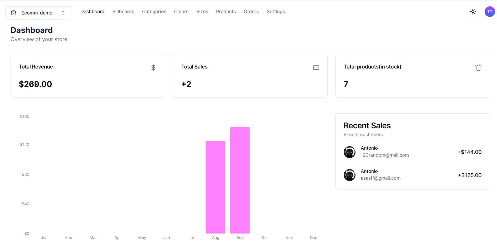
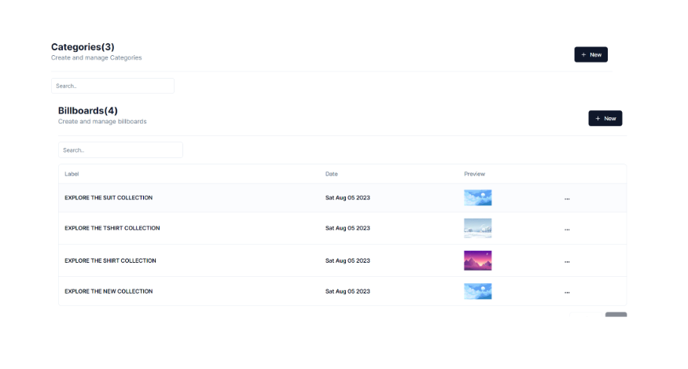
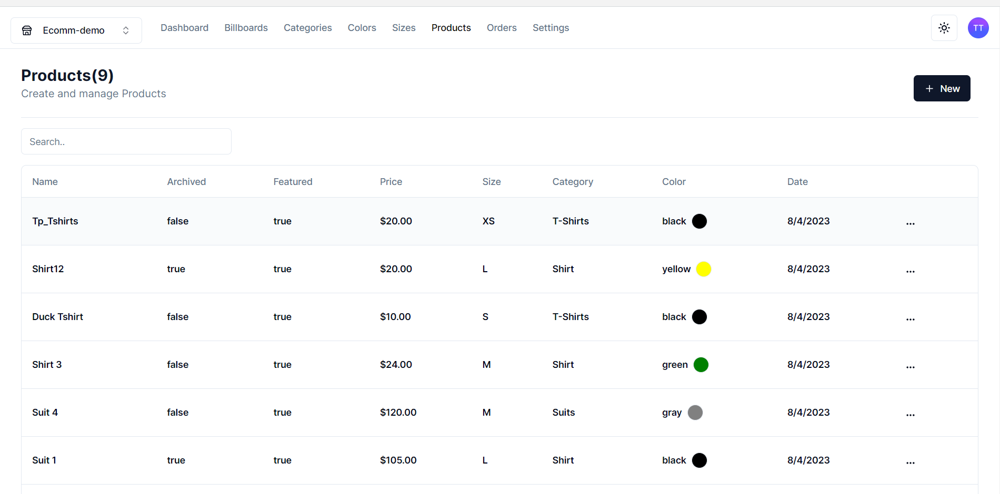
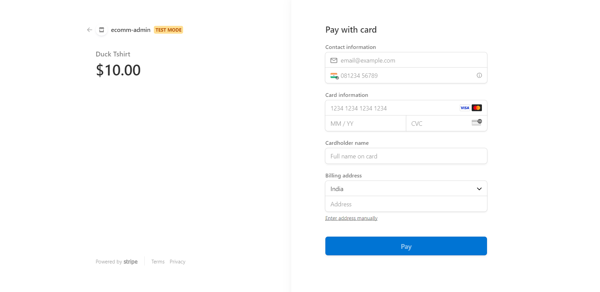
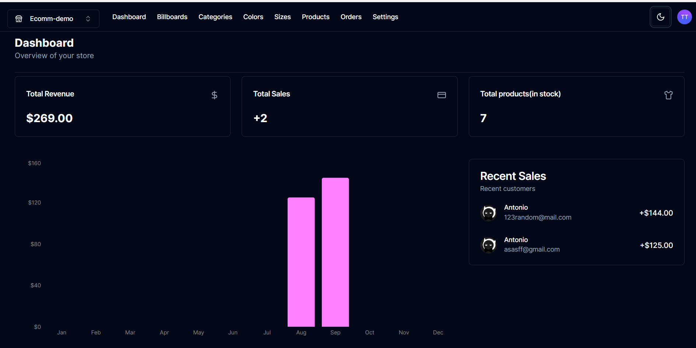

## ForgeCommerce is a headless CMS webapp where the user can create,update or delete their necessary data for making cool e-commerce stores with inbuilt payment processing and minimalistic UI
#### One use of the API can be seen providing all the necessary data to [ecomm-store](https://github.com/dhrishP/ecomm-store)
 ## Dummy Email and password for Demo
1. _Email_:- trexturbo55@gmail.com
1. _password_ :- Trex!!@@##

#### ⭐The changes made here can be seen [here](https://ecomm-store-mocha.vercel.app/)

#### Features:-
1. Beautiful minimalistic ui by [Shadcn](https://ui.shadcn.com/)

1. Creating as much categories and billboards as needed for your store

1. Creating product with all the control in your hand(featuring and archiving)

1. Realtime payment with pre and post order tracking using stripe

1. Dark and light mode

1. API ROUTES (for ease of access)

#### Techonologies used:-
1. Nextjs 
1. React
1. Tailwind/shadcn
1. postgresSQL(supabase)
1. Prisma(ORM)

#### Libraries:-
1. [shadCN](https://ui.shadcn.com/)
1. [react-hot-toast](https://react-hot-toast.com/)
1. [axios](https://www.npmjs.com/package/axios)
1. [zustand](https://docs.pmnd.rs/zustand/getting-started/introduction)

